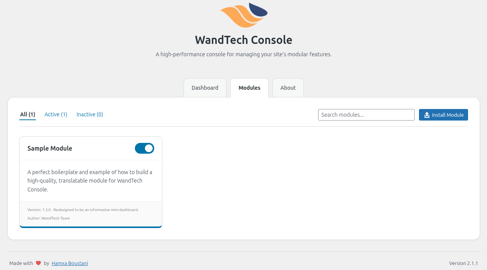

  <!--  -->
  
  <h1>WandTech Console</h1>
  
<strong>A high-performance, developer-centric framework for adding modular functionality to WordPress.</strong>

  

    
    
    
    
  

---

  <a 
    href="https://playground.wordpress.net/?blueprint-url=https://raw.githubusercontent.com/HamxaBoustani/wandtech-console/main/blueprint.json" 
    target="_blank" 
    rel="noopener"
    style="display: inline-flex; align-items: center; gap: 8px; padding: 8px 16px; font-family: -apple-system, BlinkMacSystemFont, 'Segoe UI', Roboto, sans-serif; font-size: 14px; font-weight: 600; color: #1e1e1e; background-color: #f6f8fa; border: 1px solid rgba(27, 31, 35, 0.15); border-radius: 6px; text-decoration: none; transition: background-color 0.2s ease-in-out;"
    onmouseover="this.style.backgroundColor='#f0f2f4'"
    onmouseout="this.style.backgroundColor='#f6f8fa'"
  >
    
    Open in WordPress Playground
  </a>

---

## 💡 The Philosophy: Performance Through Modularity

> Stop installing dozens of single-feature plugins. Start using one elegant, blazing-fast central hub to **enable powerful tools on demand.**

**WandTech Console** is not just another plugin; it's a lightweight **core framework** for your website's features. The core plugin itself is incredibly lean. Its only job is to provide a robust foundation and a beautiful, modern single-page-like interface—the **Console**—where you can manage **Modules**.

This architecture gives you absolute control, ensuring your site remains fast, clean, and easy to maintain by loading **only the code you need, precisely when you need it.**

---

## ✨ Key Features & Technical Advantages

| Feature | Technical Breakdown & Benefit |
|---|---|
| 🚀 **True Modular Architecture** | **Decoupled Modules:** The core is completely separate from optional modules, which reside in `wp-content/modules/`. This guarantees core stability and makes updates safer. |
| ⚡ **Context-Aware Loading** | **Performance by Design:** Modules load based on their `Scope` (`admin`, `frontend`, or `all`), ensuring zero impact on frontend speed for admin-only tools. |
| 🛡️ **Robust Dependency Engine** | **Automatic Dependency Checks:** Prevents fatal errors by validating dependencies on load and auto-deactivates modules with unmet requirements. |
| 🔌 **Extensible & Integrated UI** | **Seamless Integration:** Optional modules can deeply integrate into the Console by adding new tabs or settings sections for a completely unified experience. |
| 🔐 **Secure by Default** | **Hardened Against Vulnerabilities:** Proactively secured against CSRF (Nonces), Path Traversal, and XSS. File operations are handled securely via the WordPress Filesystem API. |
| 🛠️ **Developer-Centric Tools** | **Built-in Scaffolding:** A powerful module scaffolder appears when Developer Mode is enabled, accelerating development and enforcing best practices. |
| 🌍 **Fully Translatable & RTL Ready** | **Isolated Text Domains & Full RTL Support:** Each module manages its own translation files, and the entire console is designed for global audiences. |

---

## 🚀 Installation

1.  Download the latest `.zip` from the **[Releases](https://github.com/HamxaBoustani/wandtech-console/releases)** page.
2.  In your WordPress admin dashboard, navigate to **Plugins > Add New Plugin**.
3.  Click **Upload Plugin**, select the downloaded `.zip` file, and click **Install Now**.
4.  After installation, **Activate** the plugin. The framework will automatically create the `wp-content/modules/` directory for you.

---

## ⚙️ How to Use

1.  Upon activation, a new menu item, **"WandTech,"** will appear in your WordPress dashboard.
2.  Click it to open the **WandTech Console**.
3.  Navigate to the **Modules** tab to view, filter, search, and manage all your modules.
4.  Click the "Install Module" button to upload and install new modules (in `.zip` format) directly from the Console.

  

---

## 👨‍💻 For Developers: Building on the Framework

WandTech Console is engineered to be the ultimate foundation for your custom WordPress features. We provide comprehensive, unified documentation to help you get started and build powerful, high-quality modules.

*   **🔌 Comprehensive API Reference:** For a complete, step-by-step guide from creating your first module to advanced development techniques, please see the **[Developer Guide](./DEVELOPER-GUIDE.md)**.

---

## 🤝 Contributing

Contributions are what make the open-source community an amazing place to learn, inspire, and create. Any contributions you make are **greatly appreciated**.

1.  Fork the Project.
2.  Create your Feature Branch (`git checkout -b feature/AmazingModule`).
3.  Commit your Changes (`git commit -m 'feat: Add some AmazingModule'`).
4.  Push to the Branch (`git push origin feature/AmazingModule`).
5.  Open a Pull Request.

---

## 🚀 Scalability & Enterprise Readiness

WandTech Console is engineered for high performance, even on large-scale websites.

#### Caching Strategy
The framework intelligently leverages the WordPress **Transients API**. For the best possible performance on high-traffic sites, we highly recommend a hosting environment with a persistent object cache, such as **Redis** or **Memcached**. The Console is "Persistent Cache Ready" and will automatically use an object cache if available.

#### Stability & Quality
The framework is engineered to be robust and self-healing. For example, it automatically deactivates modules whose dependencies are no longer met, preventing potential site crashes.

---

## 📝 Changelog

A detailed history of all changes is available in the **[CHANGELOG.md](./CHANGELOG.md)** file.

---

## 📜 License

Distributed under the **GPLv2 or later License**. See the `LICENSE` file for more information.

---

  <em>Made with ❤️ by Hamxa Boustani</em>

